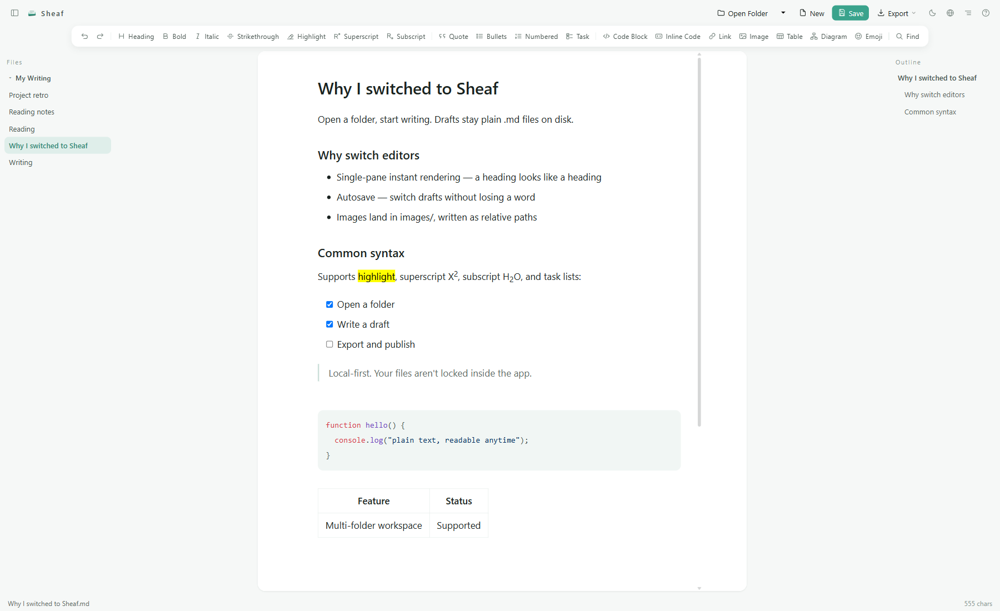

<p align="right">English | <a href="README.zh-CN.md">简体中文</a></p>

# Sheaf 🪶

**A local Markdown writing app.** Open a folder, write in a single instant-rendering pane. Files stay plain `.md` on disk.



🌐 Site: [sheafmika.com](https://sheafmika.com) · 📥 [Download for Windows](https://github.com/SiliconZero-AI/sheaf/releases)

Tested from start to finish with real writing. Packaged as a Windows installer (Tauri 2, launches from the Start menu, works offline), with a Chinese/English interface toggle.

## ✨ Features

- 📁 **Multi-folder workspace**: mount several folders at once, drag a folder/`.md`/image in to start — autosaves before you switch drafts, nothing lost
- ✍️ **Single-pane instant rendering**: a heading looks like a heading, not source-on-one-side-preview-on-the-other; pasted web content converts to Markdown automatically
- 🔍 **Real search**: `Ctrl+F` to find within a draft, `Ctrl+Shift+F` to search across every open folder, an always-on outline in the right pane
- 🎨 **Full syntax support**: `==highlight==`, superscript/subscript, footnotes, task lists, tables, Mermaid, an emoji picker — the common ones have toolbar buttons, no syntax to memorize
- 💾 **Autosave + three export formats**: writes to disk two seconds after you stop typing; export as plain `.md`, `.html`, or print to PDF
- 🔀 **Safe alongside other tools**: edit a file outside Sheaf — in an AI tool, another editor, a sync folder — and the open draft updates on its own, with no need to switch away and back, and without overwriting what changed. Rapid repeated writes are batched into one calm update rather than a flicker. If you have unsaved edits too, autosave pauses and shows both versions side by side with their length and timestamps so you can choose
- 📖 **Every draft remembers where you left off**: switch drafts, or close and reopen Sheaf, and you land back at the same place and cursor position. Your spot is tracked by the nearest heading, so text added above where you are reading does not push you off it
- 🔎 **Zoom the text**: `Ctrl` + `+` / `-` to resize everything, `Ctrl+0` to reset, `Ctrl` + scroll wheel works too — for dense drafts or a screen that sits far away, and the size you pick is remembered
- 🖼️ **Open images and diagrams full screen**: hover one and a button appears in its corner; click it to fill the window, then scroll to zoom, drag to pan, `Esc` to go back. This is what wide flowcharts need — the ones squeezed into the writing column until every label runs together
- 🌗 **Light/dark themes**: follows the system by default, lock it from the top bar
- 🌐 **Bilingual interface**: switch between Chinese and English instantly, no reload
- ⬆️ **Updates itself**: when a new version exists, Sheaf tells you at startup and lists what changed. One click downloads, installs, and reopens it — your folders and reading positions come through untouched
- 🪟 **Windows installer**: double-click to install, launch from the Start menu, zero external requests so it works offline, associates `.md` files (double-click one to open it directly in Sheaf), remembers your folders and last-open draft when you relaunch — kept outside the application data folder, so ticking "delete application data" during an upgrade does not take them with it

## 📥 Download

Grab the latest Windows installer from [Releases](https://github.com/SiliconZero-AI/sheaf/releases), double-click to install, then find "Sheaf" in the Start menu. Works offline.

**You only need to do this once.** From 0.1.4 on, Sheaf finds and installs new versions itself. If you are on 0.1.3 or earlier, download once here and it takes over from there.

macOS / Linux builds are on the roadmap below.

## 🛠️ Build from source

> Just want to use the app? The Download section above is all you need — this part is for building from source or contributing.

```bash
npm install
npm run dev        # web dev server; open the URL printed in the terminal
```

`dev` and `build` both run `scripts/sync-vditor-assets.mjs` first, which copies the editor engine's
runtime files (~11 MB) from `node_modules` into `public/vditor/`. Generated automatically, not committed.

Windows desktop app (needs [Rust](https://rustup.rs/) and the WebView2 runtime, already present on Windows 10/11):

```bash
npm install
npm run tauri build
```

The installer lands in `src-tauri/target/release/bundle/nsis/`.

To install it as a web app (PWA):

```bash
npm run build
npm run preview    # open http://localhost:4173
```

Then click the install icon in Chrome/Edge's address bar. Windows users are better off with the installer above.

Run tests:

```bash
npm test           # regression tests for image handling, guarding two real data-loss bugs from the past
```

## ⚠️ Known limitations

- **Non-UTF-8 `.md` files (GBK/GB18030, UTF-16) open read-only.** The browser can only write text back as UTF-8; allowing edits would silently corrupt your file's original encoding on save. Convert to UTF-8 in another tool first if you need to edit it.
- **Installing as a browser PWA (without the Tauri build)** points at `localhost:4173` — both the first install and every later update still need `npm run preview` running. The Windows installer isn't affected by this — its file layer is native Tauri, no local server involved.
- **Browser/PWA mode** requires Chrome or Edge because it relies on the File System Access API. The Windows installer uses its native Tauri file layer instead.

## 🚫 Not doing

10 UI languages, web-page-to-Markdown fetching, fake Word export, social-media long images, one-click publishing to WeChat, a theme store, multi-image-host support, PKM-style bidirectional linking. For publishing, use an existing formatter like doocs/md — this project solves **writing**, not publishing.

## 🗺️ Roadmap

- macOS / Linux installers (Windows only for now)
- A public online demo

## Acknowledgments

The writing surface is [Vditor](https://github.com/Vanessa219/vditor) (MIT).

## Code signing policy

Sheaf is currently unsigned. See the [Code signing policy](CODE_SIGNING_POLICY.md) for the planned verified build, review, and signing controls.

## 📜 License

MIT. Free for commercial use, no separate authorization needed.
