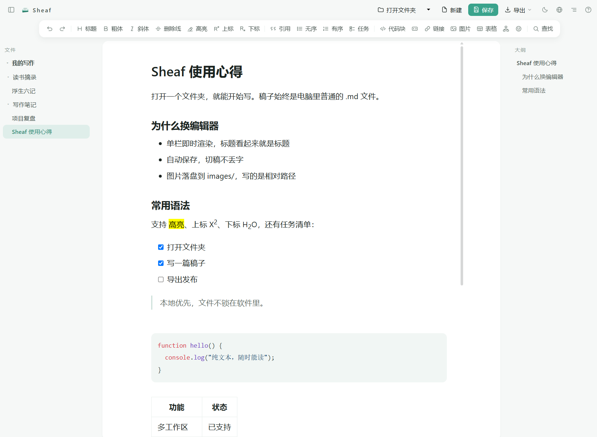

<p align="right"><a href="README.md">English</a> | 简体中文</p>

# Sheaf 🪶

**本地 Markdown 写作 App。** 打开文件夹，单栏即时渲染，文件就是磁盘上的普通 `.md`。



🌐 官网：[sheafmika.com](https://sheafmika.com) · 📥 [下载 Windows 版](https://github.com/SiliconZero-AI/sheaf/releases)

已经用真实文章完成从写作到导出的完整验收。已打成 Windows 安装包（Tauri 2，开始菜单直接开，断网也能用），支持中英文界面切换。

## ✨ 能做什么

- 📁 **多文件夹工作区**：同时挂多个文件夹，拖文件夹/`.md`/图片进来就能开始用，切稿前自动保存不丢改动
- ✍️ **单栏即时渲染**：标题就是标题，不是源码和预览分两半；网页内容复制粘贴进来自动转 Markdown
- 🔍 **真搜索**：`Ctrl+F` 单篇查找、`Ctrl+Shift+F` 跨文件搜索，右栏大纲常驻可点
- 🎨 **语法给得全**：`==高亮==`、上下标、脚注、任务清单、表格、Mermaid、表情面板（中文可搜），常用的都有按钮不用记语法
- 💾 **自动保存 + 三种导出**：停笔两秒写回磁盘；`.md` 原样导出、`.html` 网页、系统打印存 PDF
- 🔀 **和别的工具共用一个文件夹不打架**：在 Sheaf 之外改了文件——AI 工具、别的编辑器、同步盘都算——正开着的那篇会自己更新，不用切走再切回来，也不会被旧内容盖掉。对面一秒写好几次时会合并成一次更新，画面不闪。若你本地也有未保存的改动，自动保存会暂停，并把两份的字数与改动时间并排摆出来让你选
- 📖 **每篇记得上次读到哪**：切走再回来、关掉重开，都落回原来的位置和光标处。位置按最近的标题记，所以别人往你上面加了几段，你也不会被挤走
- 🔎 **正文能放大缩小**：`Ctrl` + `+` / `-` 调大小、`Ctrl+0` 回到原始大小，按住 `Ctrl` 滚滚轮也行——稿子密、人离屏幕远的时候用得上
- 🖼️ **图和流程图点开全屏看**：鼠标移上去右上角冒出按钮，点开铺满窗口，滚轮缩放、按住拖着看、`Esc` 退回来。宽流程图被压到正文栏那么窄、字全挤成一团时，就靠它
- 🌗 **深浅双主题**：默认跟系统走，顶栏一键锁定
- 🌐 **中英双语界面**：一键切换，即时生效不刷新
- ⬆️ **自己升级自己**：有新版会在启动时提示你，框里列出这一版改了什么，点一下就下载安装并重开，工作区和每篇读到哪都不会丢
- 🪟 **Windows 安装包**：双击装、开始菜单直接开，零外链断网可用，关联 `.md` 文件（双击就用 Sheaf 打开），关程序重开自动恢复上次的文件夹和稿子

## 📥 下载使用

去 [Releases](https://github.com/SiliconZero-AI/sheaf/releases) 下载最新的 Windows 安装包，双击安装，开始菜单里找到「Sheaf」打开就能用。断网也能开。

**装过一次之后就不用再来了**：从 0.1.4 起，有新版 Sheaf 会自己提示并完成更新。已经装了 0.1.3 或更早版本的话，这里手动下载一次，之后交给它自己。

macOS / Linux 安装包还在做，见下面「路线图」。

## 🛠️ 从源码构建

> 只是想用软件的话，上面「下载使用」那节就够了，这节是给想自己编译或者贡献代码的人看的。

```bash
npm install
npm run dev        # 网页开发模式，浏览器打开终端提示的地址
```

`dev` 和 `build` 之前会自动跑一次 `scripts/sync-vditor-assets.mjs`，把编辑器引擎需要的运行时文件
（约 11 MB）从 `node_modules` 复制进 `public/vditor/`，每次自动生成、不进仓库。

打 Windows 桌面包（需要 [Rust](https://rustup.rs/) 和 WebView2，Win10/11 通常已自带）：

```bash
npm install
npm run tauri build
```

安装包在 `src-tauri/target/release/bundle/nsis/`。

想在浏览器里装成网页版（PWA）：

```bash
npm run build
npm run preview    # 打开 http://localhost:4173
```

然后在 Chrome / Edge 地址栏点「安装」图标。Windows 用户直接下载安装包更省事，不用走这条路。

跑测试：

```bash
npm test           # 图片落盘的回归测试，守着两条曾经真实发生的丢稿缺陷
```

## ⚠️ 已知限制

- **非 UTF-8 的 `.md`（GBK/GB18030、UTF-16）以只读方式打开。** 浏览器只能把文本存回 UTF-8，允许编辑就意味着保存时会悄悄换掉你原文的编码。想编辑请先用别的工具转成 UTF-8。
- **只想用浏览器装成 PWA（不打 Tauri 包）的话**，装的地址是 `localhost:4173`，首次安装和之后每次更新版本仍然需要把 `npm run preview` 跑起来。Windows 安装包不受这条限制——文件层是 Tauri 原生实现，不依赖本地服务。
- **浏览器/PWA 模式**需要 Chrome 或 Edge，因为它依赖 File System Access API；Windows 安装包走 Tauri 原生文件层，不受这条限制。

## 🚫 故意不做

10 种语言、网页转 MD、假 Word、社交长图、复制到公众号、主题商店、多图床、PKM 双链图谱。发公众号请用 doocs/md 等现成排版器——这个项目解决的是**写**，不是发。

## 🗺️ 路线图

- macOS / Linux 正式安装包（目前只有 Windows）
- 公网可试用的在线演示

## 致谢

写作面使用 [Vditor](https://github.com/Vanessa219/vditor)（MIT）。

## 代码签名政策

Sheaf 当前尚未签名。计划采用的可验证构建、审查与签名规则见 [Code signing policy](CODE_SIGNING_POLICY.md)。

## 📜 License

MIT。可自由商用，无需另行授权。
